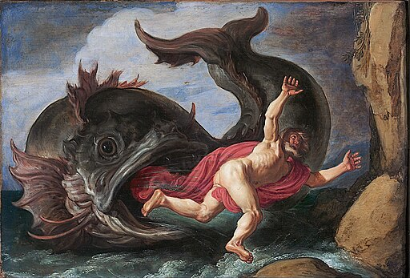

  

## About `jonah`
It's just `dind` (docker-in-docker). Jonah (docker) is inside the whale (also docker).

## So you're telling me...
Yes, that's right. This is a dumb joke that basically no one will see, and no one will think is funny.

## But... Just... Why???
I woke up a little before 2am on Friday, March 28th, 2025 and couldn't get back to sleep until I had done enough research to know if this had already been done. The answer was, "maybe" but if so, no one bothered to document why their image was named Jonah.

